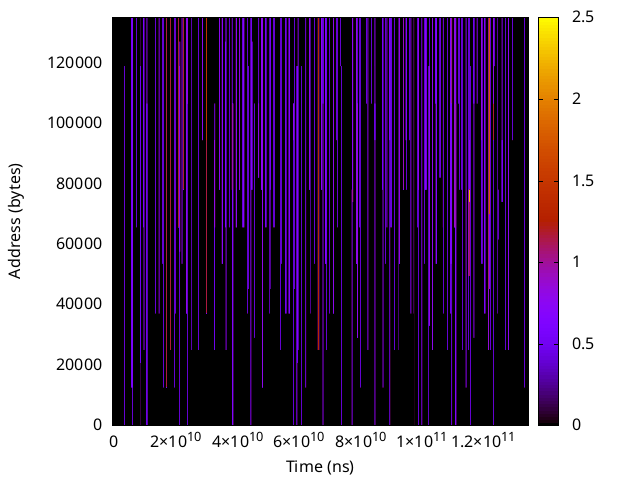
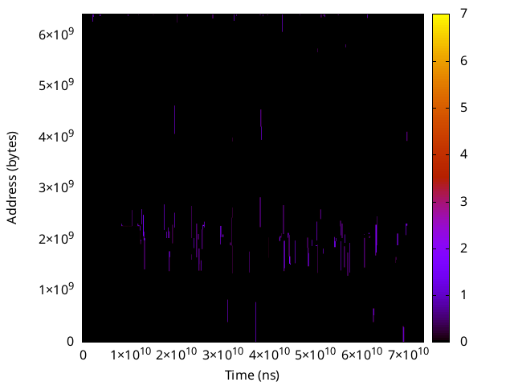

# Memory Monitoring in Memory-Intensive Server-Client Interactions

This repository documents the work completed by Athanasios Kaousias as an optional project for the Embedded Systems course at the Microlab of the National Technical University of Athens (NTUA). The project investigates the use of DAMON (Data Access MONitoring) and DAMO (DAMON's user-space tool) for memory monitoring in Linux, specifically focusing on memory-intensive server-client interactions.

## Acknowledgments
Special thanks to Achilleas Tzenetopoulos, PhD candidate at NTUA, for his valuable advice, guidance, and support throughout this project.

## Project Overview

The primary objective of this project was to investigate the utility of DAMON and DAMO for monitoring and analyzing memory access patterns in resource-intensive applications. DAMON is a kernel-level data access monitoring framework in Linux that tracks memory access patterns with low overhead, while DAMO provides a user-space interface to configure, control, and visualize DAMON's monitoring data. More information about DAMON and DAMO can be found in the Linux kernel documentation and the official GitHub repositories.

This project implements three distinct use cases to evaluate memory behavior under varying workloads, with a focus on server-client interactions. The server processes requests from clients, and memory access intensity and Working Set Size (WSS) are monitored over time using DAMON and visualized via DAMO.

## Use Cases

The following use cases were developed to simulate memory-intensive operations, with each consisting of a server component and a client component. The client repeatedly invokes the server to stress its memory usage, while DAMON monitors the server's memory access patterns:

1. **DNA Visualization (dna_viz)**  
   This use case processes genomic data stored in FASTA format, downloading it from a storage system (e.g., MinIO), transforming it using a custom library, and uploading the results. The client specifies the data size to vary the workload intensity.

2. **Graph PageRank (graph_pagerank)**  
   This use case generates a random graph using the Barabási-Albert model and computes PageRank scores. The client configures the number of nodes and edges per node to adjust the memory and computational demands.

3. **Image Recognition (image_recognition)**  
   This use case performs image classification using a pre-trained ResNet50 model, downloading images from storage, preprocessing them, and inferring labels. The client selects images of different sizes to simulate varying memory loads.

For each use case, the server runs continuously, and the client is invoked repeatedly to generate stress on the server’s memory usage. DAMON records memory access intensity and WSS over time, focusing on three regions of interest (ROIs) within the server’s memory space. These regions, monitored by DAMO, share the same time axis but differ in the scale of the memory area size, as depicted in the accompanying visualizations.

Users can explore the intensive memory access patterns and WSS for each use case by referring to the provided figures in the `figures/` directory.

## Memory Monitoring with DAMON and DAMO

The project leverages DAMON to monitor memory access patterns and DAMO to configure and visualize the data. The server’s memory behavior is tracked across different operational modes:  
- **DAMON mode**: Monitoring enabled with DAMON to record access intensity and WSS.  
- **Normal mode**: Monitoring disabled, serving as a baseline for comparison.  

To evaluate the impact of DAMON monitoring, we analyzed the performance of the DNA Visualization use case, comparing execution times (download, processing, upload, and total) with and without DAMON active. The results, visualized in the following box plot, indicate a minor performance overhead due to DAMON monitoring:

## Visualizations of Memory Access Patterns and WSS

The repository includes visualizations of memory access intensity and Working Set Size (WSS) for each use case, focusing on three regions of interest (ROIs) per use case. These regions share the same time axis but differ in the scale of the memory area size. The figures are available in the `figures/` directory:

### DNA Visualization (dna_viz)
- **Region 0**:   
- **Region 1**:   
- **Region 2**:   
- **WSS Over Time**: 

### Graph PageRank (graph_pagerank)
- **Region 0**:   
- **Region 1**:   
- **Region 2**:   
- **WSS Over Time**: 

### Image Recognition (image_recognition)
- **Region 0**:   
- **Region 1**:   
- **Region 2**:   
- **WSS Over Time**: 

These visualizations allow users to examine the memory access patterns and WSS for each use case across the monitored regions.

## Potential Expansions

Potential future directions include:  
- Implementing DAMOS (DAMON’s Schemes) for proactive memory reclaiming in heterogeneous memory architectures  
- Extending DAMON monitoring to other memory-intensive applications or real-time systems.  
- Enhancing DAMO visualizations for deeper insights into memory access patterns.

## Additional Scripts

This repository also includes several bash scripts that assisted in configuring, monitoring, and automating the experiments with DAMON and DAMO. These scripts can be found in the `scripts/` directory.
